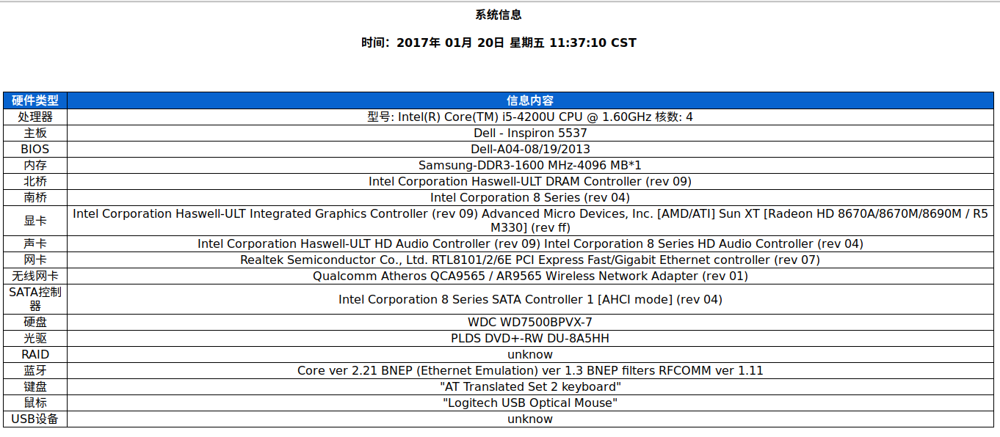
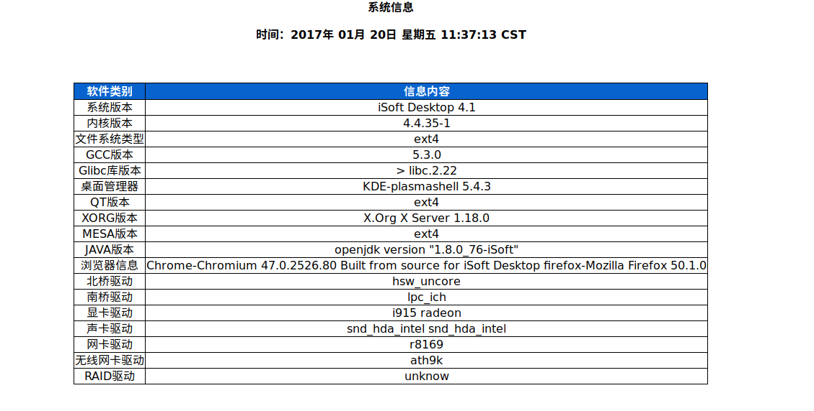

## Used to detect linux platform's hardware and software information

## howto

    usage: info_test.sh [ -t TEST TYPE ] [ -o OS TYPE ]
    
    -t TESTTYPE Test type support : ALL|HW|SW
                                    ALL include HW and SW
                                    HW:MB/BIOS/CPU/MEM/NB/SB/GRAPHIC/AUDIO/LAN/WLAN/SATA/HDD/ODD/RAID/BLUE/
                                    KB/MS/USB
                                    SW:OS/KERNEL/FS/GCC/GLIBC/LLVM/QT/XORG/MESA/JAVA/CHORMIUM/FIREFOX/SWAP

    -h help
    -v version
    example: info_test.sh -t "ALL"

### Hw info

### Sw info

